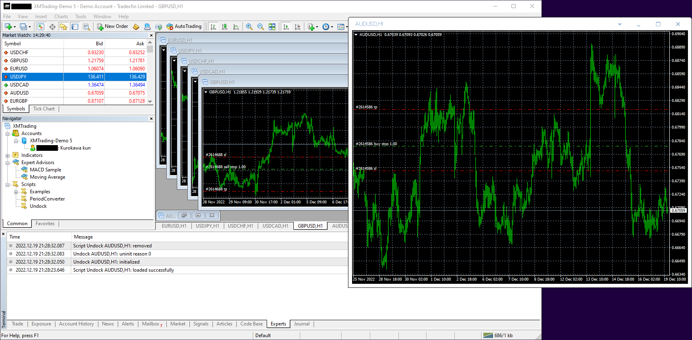

# MT4-Chart-Undocker
## 説明
MT4のチャートウィンドウをMT4本体から切り離して表示します。  
  

## 使用方法
1. ReleasesからMT4-Chart-Undocker.zipをダウンロードします。
1. zipファイルの中身をMT4のデータフォルダにコピーします。  
    ※ デフォルトのデータフォルダは以下：  
    C:\Users\（ユーザー名）\AppData\Roaming\MetaQuotes\Terminal\（インスタンスID）
1. MT4を起動します。
1. NavigatorウィンドウのScriptsツリーからUndockをチャートに貼り付けます。  
    ※ 「DLLの使用を許可する」にチェックを入れてください
    
## 必要なもの
本ツールを利用するにはMT4が必要です。MT4は各証券会社がHPで無料配布しています。

## 既知の問題
- 切り離されたチャート画面上で右クリックして注文の取消または変更を行うとチャート画面が元に戻りません。この場合はチャート画面上の別な場所で再度右クリックすると元に戻ります（実用上は問題ないので気が向いたら直します…）。
- Windowsのタイトルバーのフォントサイズを変更している場合、タイトルバーが正しく描画されません（こちらも実用上は問題ないので気が向いたら直します…）。

## 補足
- MT5での利用
    - MT5にはUndock機能が標準でついています。MT5ユーザーの方はこちらをお使いください。
- コンパイル時の注意点
    - x86 DLLライブラリとしてコンパイルしてください。x64ではMT4によるロードできません。
    - Debugビルドの場合、ウィンドウの描画テストも兼ねているのでウィンドウの色は通常と異なったものになります。
